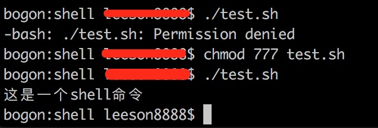

# mac终端下运行shell脚本
- 1.编写:test.sh
```sh
echo "这是一个shell命令"
```
- 2.  在终端输入：  ./test.sh

- 3. 如果没有权限,提示`-bash: ./test.sh: Permission denied`，则 `chmod 777 test.sh` 。

例如：


# 编写Shell 脚本执行一段命令得到其执行时间

```js
// diffc.js
//  #!/usr/bin/env node 告知脚本使用nodejs环境
#!/usr/bin/env node


//spawn的格式为spawn(command, [args], [options])
var util = require('util'),
    spawn = require('child_process').spawn,
    ls = spawn('du', ['-m', '/home/']);

    // + 将时间转为时间戳，例如 2017-06-20T17:21:55.479Z ==》1497979297390
var start = +new Date();
ls.stdout.on('data', function (data) {
    //console.log('stdout: ' + data);
});
ls.stderr.on('data', function (data) {
    console.log('stderr: ' + data);
});
ls.on('exit', function (code) {
    var end = +new Date();
    console.log(end - start);
});

```
执行 ./diffc.js 输出 9(毫秒，时间戳)


> du会显示指定的目录或文件所占用的磁盘空间。diskuesd


# 重点
```js
#!/usr/bin/env node
//告诉操作系统应该拿什么程序来解释这个脚本

chmod 777 script.js
//赋予完全权限

```


# npm link命令，为当前模块创建一个符号链接

在当前项目目录创建 app.js
```js
#!/usr/bin/env node
console.log("hello,npm link");
```

赋予权限:`chmod 777 ./app.js`

执行：npm init -y 生成package.json文件,并添加bin属性：

```js
  "bin": {
    "myapp": "./app.js"
  },
```

执行：npm link

输出如下，说明创建链接成功
```js
up to date in 0.094s
/usr/local/bin/myapp -> /usr/local/lib/node_modules/package/app.js
/usr/local/lib/node_modules/package -> /usr/local/var/www/gitclone/github-blog/code/node/package
```

执行：`myapp`

输出：hello,npm link


参考文章：http://www.infoq.com/cn/articles/yph-shell-meet-nodejs/